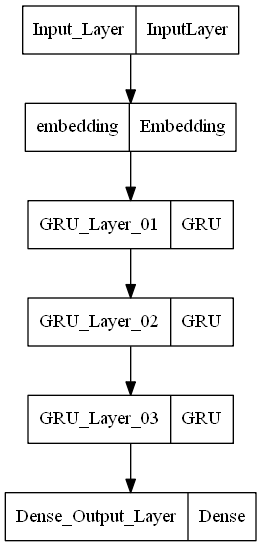

# Facial Recognition. Prediction of person Identity from facial image.

Facial Recognition has been deployed in many different scenarios, most famously in mobile phones.  
In this project we use a subset of the "Labeled Faces in the Wild" dataset to test some models for facial recognition.

## Required Python Packages
- numpy
- pandas
- sklearn
- matplotlib
- seaborn
- tensorflow
- keras

## Data Used
The Labeled Faces in the Wild dataset can be found under below link from the University of Massachusetts.  
<http://vis-www.cs.umass.edu/lfw/index.html>  

We will use the sklearn functions specially designed to extract our sample images from the raw data.  
To make our test use case easier, we will only consider individuals with at least 100 images in the dataset.  

The dataset considered had a total of 1140 images, with dimensions (125, 94, 3).  
Based on the requirement of at least 100 images per person, the dataset was reduced two 5 unique labels.  

0: 'Colin Powell' 
1: 'Donald Rumsfeld' 
2: 'George W Bush' 
3: 'Gerhard Schroeder' 
4: 'Tony Blair' 

For reference, below are two sample images from the dataset.

## Training

After splitting the dataset into training set (80%) and test set (20%), 6 different deep learning models were trained in Tenserflow Keras.  
During each training epoch, a random 20% of the training set was held out for validation.  
For comparison, the accuracy on the last training epoch validation set was considered.  

## Evaluation and model selection with cross-validation

Below performance was achieved by the different candidate models on training set validation portion on the last training epoch.

| Model                                                                         | Validation\_Loss | Validation\_Accuracy |
| ----------------------------------------------------------------------------- | ---------------- | -------------------- |
| Model 1: Pre-Trained VGG16 + Fully Connected Layers                           | 4.650881         | 0.456522             |
| Model 2: Pre-Trained resnet50 + Fully Connected Layers                        | 26.674942        | 0.456522             |
| Model 3: Pre-Trained Xception + Fully Connected Layers                        | 26.927071        | 0.456522             |
| Model 4: Pre-Trained VGG16 + Convolutional Layers + Fully Connected Layers    | 1.026759         | 0.815217             |
| Model 5: Pre-Trained Resnet50 + Convolutional Layers + Fully Connected Layers | 1.190163         | 0.858696             |
| Model 6: Pre-Trained Xception + Convolutional Layers + Fully Connected Layers | 1.776408         | 0.576087             |

The model selected with the best Validation performance was the Model 5 (Pre-Trained Resnet50 + Convolutional Layers + Fully Connected Layers), with a validation accuracy of 85.9%.  

| Model                                                                         | Validation\_Loss | Validation\_Accuracy |
| ----------------------------------------------------------------------------- | ---------------- | -------------------- |
| Model 5: Pre-Trained Resnet50 + Convolutional Layers + Fully Connected Layers | 1.190163         | 0.858696             |

## Best model architecture

## Results on out of sample test-set

The model selected with the best Validation performance was the Model 5 (Pre-Trained Resnet50 + Convolutional Layers + Fully Connected Layers), with a validation accuracy of 85.9%.  

Below out of sample performance was achieved by the best model on the test set.

| Model                                                                         | Test\_Accuracy       |
| ----------------------------------------------------------------------------- | -------------------- |
| Model 5: Pre-Trained Resnet50 + Convolutional Layers + Fully Connected Layers | 0.851                |

The model selected with the best Validation performance was the Model 5 (Pre-Trained Resnet50 + Convolutional Layers + Fully Connected Layers), with an test set accuracy of 85.1%.  

## Appendix

